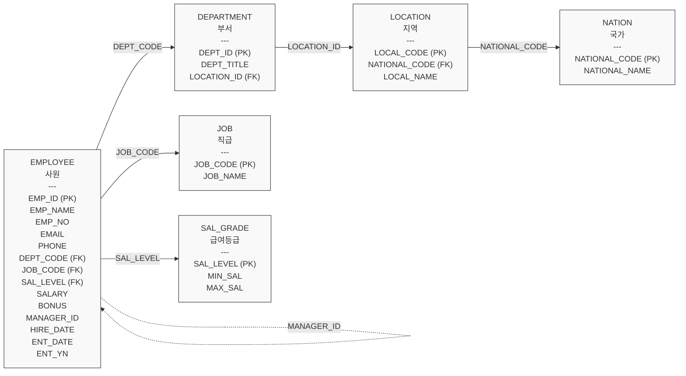

### :link: 2025-05-19
- [WHERE](#where)
- [DISTINCT](#distinct)
- [LIMIT](#limit)
- [JOIN](#join)
- [GROUPING](#grouping)
- [SUBQUERY](#subquery)
- [문제](#7-문제)
 
&nbsp;
### 1. WHERE

- WHERE절은 특정 조건에 맞는 레코드만을 선택하는데 사용되며 다양한 방법으로 조건을 설정할 수 있다.

#### 1) 비교 연산자
```sql
SELECT
       MENU_NAME
     , MENU_PRICE
     , ORDERABLE_STATUS
  FROM TBL_MENU
 WHERE ORDERABLE_STATUS = 'Y';
 
SELECT
       MENU_NAME
     , MENU_PRICE
     , ORDERABLE_STATUS
  FROM TBL_MENU
 WHERE MENU_PRICE = 13000;
```

같지 않음 연산자와 함께 WHERE절 사용

```sql
SELECT
       MENU_CODE
     , MENU_NAME
     , ORDERABLE_STATUS
  FROM TBL_MENU
 WHERE ORDERABLE_STATUS != 'Y';
```
대소 비교 연산자와 함께 WHERE절 사용

```sql
SELECT
       MENU_CODE
     , MENU_NAME
     , MENU_PRICE
  FROM TBL_MENU
 WHERE MENU_PRICE > 20000;
 
SELECT
       MENU_CODE
     , MENU_NAME
     , MENU_PRICE
  FROM TBL_MENU
 WHERE MENU_PRICE <= 20000;
```

#### 2) AND연산자

```sql
SELECT
       MENU_NAME
     , MENU_PRICE
     , CATEGORY_CODE
     , ORDERABLE_STATUS
  FROM TBL_MENU
 WHERE ORDERABLE_STATUS = 'Y'
   AND CATEGORY_CODE = 10;
   
-- 메뉴이름, 메뉴가격, 카테고리 코드, 판매상태를 조회하는데,
-- 메뉴가격이 5000원 초과이고 카테고리 코드가 10번인것을 조회하시오.
SELECT
       MENU_NAME
     , MENU_PRICE
     , CATEGORY_CODE
     , ORDERABLE_STATUS
  FROM TBL_MENU
 WHERE MENU_PRICE > 5000
   AND CATEGORY_CODE = 10;
```

#### 3) OR 연산자

```sql
SELECT
       MENU_NAME
     , MENU_PRICE
     , CATEGORY_CODE
     , ORDERABLE_STATUS
  FROM TBL_MENU
 WHERE ORDERABLE_STATUS= 'Y'
    OR CATEGORY_CODE = 10
 ORDER BY CATEGORY_CODE;
 
SELECT
       MENU_NAME
     , MENU_PRICE
     , CATEGORY_CODE
     , ORDERABLE_STATUS
  FROM TBL_MENU
 WHERE MENU_PRICE > 5000
    OR CATEGORY_CODE = 10;
    
-- 메뉴 코드, 메뉴 이름, 메뉴 가격, 카테고리 코드, 판매상태를 조회하는데
-- 카테고리 코드가 4번이거나 메뉴 가격이 9000원이면서 메뉴코드가 10번 초과인 것을 조회하시오.
SELECT
       MENU_CODE
     , MENU_NAME
     , MENU_PRICE
     , CATEGORY_CODE
     , ORDERABLE_STATUS
  FROM TBL_MENU
 WHERE CATEGORY_CODE = 4
    OR MENU_PRICE = 9000
   AND MENU_CODE > 10;
```

#### 4) BETWEEN 연산자

```sql
SELECT 
       MENU_NAME
     , MENU_PRICE
     , CATEGORY_CODE
  FROM TBL_MENU
 WHERE MENU_PRICE >= 10000
   AND MENU_PRICE <= 25000
 ORDER BY MENU_PRICE;  
 
SELECT 
       MENU_NAME
     , MENU_PRICE
     , CATEGORY_CODE
  FROM TBL_MENU
 WHERE MENU_PRICE BETWEEN 10000 AND 25000
 ORDER BY MENU_PRICE;
 
-- 부정 표현
SELECT 
       MENU_NAME
     , MENU_PRICE
     , CATEGORY_CODE
  FROM TBL_MENU
 WHERE MENU_PRICE NOT BETWEEN 10000 AND 25000
 ORDER BY MENU_PRICE;
```

#### 5) LIKE 연산자

```sql
SELECT
       MENU_NAME
     , MENU_PRICE
  FROM TBL_MENU
 WHERE MENU_NAME LIKE '%마늘%'
 ORDER BY MENU_NAME;
 
-- 메뉴 코드, 메뉴 이름, 메뉴 가격, 카테고리 코드, 판매상태를 조회하는데
-- 메뉴 가격이 5000 초과이면서 카테고리코드가 10번이면서
-- 메뉴 이름이 갈치가 포함된 메뉴를 조회하시오.
SELECT
       MENU_CODE
     , MENU_NAME
     , MENU_PRICE
     , CATEGORY_CODE
     , ORDERABLE_STATUS
  FROM TBL_MENU    
 WHERE MENU_PRICE > 5000
   AND CATEGORY_CODE = 10
   AND MENU_NAME LIKE '%갈치%';
   
-- 부정 표현
SELECT
       MENU_NAME
     , MENU_PRICE
  FROM TBL_MENU
 WHERE MENU_NAME NOT LIKE '%마늘%'
 ORDER BY MENU_NAME;
```

#### 6) IN 연산자

```sql
SELECT
       MENU_NAME
     , CATEGORY_CODE
  FROM TBL_MENU
 WHERE CATEGORY_CODE = 4
    OR CATEGORY_CODE = 5
    OR CATEGORY_CODE = 6
 ORDER BY CATEGORY_CODE;   
 
SELECT
       MENU_NAME
     , CATEGORY_CODE
  FROM TBL_MENU
 WHERE CATEGORY_CODE IN (4,5,6)
 ORDER BY CATEGORY_CODE;
 
-- 부정 표현 
SELECT
       MENU_NAME
     , CATEGORY_CODE
  FROM TBL_MENU
 WHERE CATEGORY_CODE NOT IN (4,5,6)
 ORDER BY CATEGORY_CODE;
```

#### 7) IS NULL 연산자

```sql
SELECT
       CATEGORY_CODE
     , CATEGORY_NAME
     , REF_CATEGORY_CODE
  FROM TBL_CATEGORY
 WHERE REF_CATEGORY_CODE IS NULL; 

-- 부정 표현 
SELECT
       CATEGORY_CODE
     , CATEGORY_NAME
     , REF_CATEGORY_CODE
  FROM TBL_CATEGORY
 WHERE REF_CATEGORY_CODE IS NOT NULL;
```
&nbsp;
### 2. DISTINCT

- 중복된 값을 제거하는데 사용
- 컬럼에 있는 컬럼값들의 종류를 쉽게 파악 가능

```sql
SELECT
       CATEGORY_CODE
  FROM TBL_MENU
  ORDER BY CATEGORY_CODE; 
```

단일 열 DISTINCT 활용

```sql  
SELECT
       DISTINCT CATEGORY_CODE
  FROM TBL_MENU
  ORDER BY CATEGORY_CODE;
  
SELECT
       REF_CATEGORY_CODE
  FROM TBL_CATEGORY; 
```

 NULL 값을 포함한 열의 DISTINCT 활용

```sql
SELECT
       DISTINCT REF_CATEGORY_CODE
  FROM TBL_CATEGORY;
```

다중열 조회

```sql
SELECT
       CATEGORY_CODE
     , ORDERABLE_STATUS
  FROM TBL_MENU;   
```

다중열 DISTINCT 사용
- 다중열의 값들이 모두 동일하면 중복된 것으로 판별한다.

```sql
SELECT DISTINCT
       CATEGORY_CODE
     , ORDERABLE_STATUS
  FROM TBL_MENU;
```
&nbsp;
### 3. LIMIT

- SELECT문의 결과 집합에서 반환할 행의 수를 제한하는데 사용된다.

전체 행 조회

```sql
SELECT
       MENU_CODE
     , MENU_NAME
     , MENU_PRICE
  FROM TBL_MENU
  ORDER BY MENU_PRICE DESC;
```

2번 행부터 5번 행까지 조회

```sql
SELECT
       MENU_CODE
     , MENU_NAME
     , MENU_PRICE
  FROM TBL_MENU
  ORDER BY MENU_PRICE DESC
  LIMIT 1, 4;
```

상위 다섯 줄의 행만 조회

```sql
SELECT
       MENU_CODE
     , MENU_NAME
     , MENU_PRICE
  FROM TBL_MENU
  ORDER BY MENU_PRICE DESC,
           MENU_NAME ASC
  LIMIT 5;
```
&nbsp;
### 4. JOIN

- 두 개 이상의 테이블을 관련 있는 컬럼을 통해 결합하는데 사용
- 두 개 이상 테이블은 반드시 연관 있는 컬럼이 존재해야 하며 이를 통해 JOIN된 테이블들의 컬럼을 모두 활용할 수 있음

#### ALIAS

- SQL문의 컬럼 또는 테이블에 별칭(ALIAS)을 달아줄 수 있음

```sql
SELECT
       MENU_CODE AS 'code'
     , MENU_NAME name
     , MENU_PRICE 'price'
  FROM TBL_MENU
  ORDER BY MENU_PRICE;
```
- 테이블 별칭은 AS를 써도 되고 생략도 가능

```sql
SELECT
       A.CATEGORY_CODE
     , A.MENU_NAME
  FROM TBL_MENU A 
  ORDER BY A.CATEGORY_CODE,
           A.MENU_NAME;
```

#### INNER JOIN
- INNER JOIN : INNER 키워드는 생략 가능
- ON을 활용한 JOIN : 컬럼명이 같거나 다를 경우 ON으로 서로 연관있는 컬럼에 대한 조건을 작성하여 JOIN

```sql
SELECT
       A.MENU_NAME
     , B.CATEGORY_NAME
  FROM TBL_MENU A
--  INNER JOIN TBL_CATEGORY B ON A.CATEGORY_CODE = B.CATEGORY_CODE;
  JOIN TBL_CATEGORY B ON A.CATEGORY_CODE = B.CATEGORY_CODE;
```

#### USING
- 컬럼명이 같을 경우 USING으로 서로 연관있는 컬럼에 대한 조건을 작성하여 JOIN

```sql
SELECT
       A.MENU_NAME
     , B.CATEGORY_NAME
  FROM TBL_MENU A
  INNER JOIN TBL_CATEGORY B USING(CATEGORY_CODE);
```

#### LEFT JOIN
- 첫 번째(왼쪽) 테이블의 모든 레코드와 두 번째(오른쪽)테이블에서 일치하는 레코드를 반환하는 JOIN

```sql
SELECT
       A.CATEGORY_CODE
     , B.MENU_NAME
  FROM TBL_CATEGORY A
  LEFT JOIN TBL_MENU B ON A.CATEGORY_CODE = B.CATEGORY_CODE;
```

#### RIGHT JOIN
- 두 번째(오른쪽) 테이블의 모든 레코드와 첫 번째(왼쪽)테이블에서 일치하는 레코드를 반환하는 JOIN

```sql
SELECT
       A.CATEGORY_CODE
     , B.MENU_NAME
  FROM TBL_CATEGORY A
  RIGHT JOIN TBL_MENU B ON A.CATEGORY_CODE = B.CATEGORY_CODE;
```

#### CROSS JOIN
- 두 테이블의 모든 가능한 조합을 반환하는 JOIN

```sql
SELECT
       A.MENU_NAME
     , B.CATEGORY_NAME
  FROM TBL_MENU A
  CROSS JOIN TBL_CATEGORY B;
```

#### SELF JOIN
- 같은 테이블 내에서 행과 행 사이의 관계를 찾기 위해 사용되는 SQL JOIN
- 카테고리별 대분류 확인을 위한 SELF JOIN

```sql
SELECT
       A.CATEGORY_NAME
     , B.CATEGORY_NAME
  FROM TBL_CATEGORY A
  JOIN TBL_CATEGORY B ON A.REF_CATEGORY_CODE = B.CATEGORY_CODE
  WHERE A.REF_CATEGORY_CODE IS NOT NULL;
```
&nbsp;
### 5. GROUPING

- 결과 집합을 특정 열의 값에 따라 그룹화 하는데 사용
- HAVING은 GROUP BY절과 함께 사용해야 하며 그룹에 대한 조건을 적용하는데 사용된다.

#### 1) GROUP BY

```sql
SELECT
       CATEGORY_CODE
  FROM TBL_MENU
  GROUP BY CATEGORY_CODE;
```

COUNT 함수 활용

```sql
SELECT
       CATEGORY_CODE
     , COUNT(*)
  FROM TBL_MENU
  GROUP BY CATEGORY_CODE;
```

SUM 함수 활용

```sql
SELECT
       CATEGORY_CODE
     , SUM(MENU_PRICE)
  FROM TBL_MENU
  GROUP BY CATEGORY_CODE;
```

AVG 함수 활용

```sql
SELECT
       CATEGORY_CODE
     , AVG(MENU_PRICE)
  FROM TBL_MENU
  GROUP BY CATEGORY_CODE;
```

2개 이상의 그룹 생성

```sql
SELECT
       MENU_PRICE
     , CATEGORY_CODE
  FROM TBL_MENU
  GROUP BY MENU_PRICE
         , CATEGORY_CODE;
```

#### 2) HAVING

5번 카테고리(중식)부터 8번 카테고리(커피)까지의 메뉴 카테고리 번호 조회

```sql
SELECT
       CATEGORY_CODE
  FROM TBL_MENU
  GROUP BY CATEGORY_CODE
  HAVING CATEGORY_CODE BETWEEN 5 AND 8;
```

#### 3) ROLL UP

컬럼 한 개를 활용한 ROLLUP(카테고리의 총합)

```sql
SELECT
       CATEGORY_CODE
     , SUM(MENU_PRICE)
  FROM TBL_MENU
  GROUP BY CATEGORY_CODE
  WITH ROLLUP;
```

컬럼 두 개를 활용한 ROLLUP (같은 메뉴 가격별 총합 및 해당 메뉴 가격별 같은 카테고리의 총합)

```sql
SELECT
       MENU_PRICE
     , CATEGORY_CODE
     , SUM(MENU_PRICE)
  FROM TBL_MENU
  GROUP BY MENU_PRICE
         , CATEGORY_CODE
  WITH ROLLUP;
```
&nbsp;
### 6. SUBQUERY

- 다른 쿼리 내에서 실행되는 쿼리이다.
- SUBQUERY의 결과를 활용해서 복잡한 MAINQUERY를 작성해 한번에 여러 작업을 수행할 수 있음

#### 서브쿼리

```sql
SELECT
       CATEGORY_CODE
  FROM TBL_MENU
 WHERE MENU_NAME = '민트미역국';
```

#### 메인쿼리
다중열 결과 조회

```sql
SELECT
       MENU_CODE
     , MENU_NAME
     , MENU_PRICE
     , CATEGORY_CODE
     , ORDERABLE_STATUS
  FROM TBL_MENU;
```

#### 서브쿼리를 활용한 메인쿼리

```sql
SELECT
       MENU_CODE
     , MENU_NAME
     , MENU_PRICE
     , CATEGORY_CODE
     , ORDERABLE_STATUS
  FROM TBL_MENU
 WHERE CATEGORY_CODE = (SELECT
                               CATEGORY_CODE
                        FROM TBL_MENU
                       WHERE MENU_NAME = '민트미역국');
```
#### 활용

```sql
SELECT
       COUNT(*) AS 'count'
  FROM TBL_MENU
  GROUP BY CATEGORY_CODE;
```

```sql
SELECT
       MAX(count)
  FROM (SELECT
               COUNT(*) AS 'count'
          FROM TBL_MENU
         GROUP BY CATEGORY_CODE) AS countmenu;
```

```sql
SELECT
       AVG(MENU_PRICE)
  FROM TBL_MENU;
```

&emsp; 전체 메뉴 평균가격 보다 높은 가격의 메뉴 전체 조회

```sql
SELECT
       MENU_CODE
     , MENU_NAME
     , MENU_PRICE
     , CATEGORY_CODE
     , ORDERABLE_STATUS
  FROM TBL_MENU
 WHERE MENU_PRICE > (SELECT
                            AVG(MENU_PRICE)
                       FROM TBL_MENU);
```
&nbsp;
### 7. 문제
#### SQL
#### 0)

#### 1) SELECT, WHERE
```SQL
-- 모든 행 모든 컬럼 조회
-- 1. EMPLOYEE테이블에서 모든 정보를 조회하세요
SELECT * FROM EMPLOYEE;

-- 원하는 컬럼 조회
-- 2. EMPLOYEE 테이블의 사번, 이름을 조회하세요
SELECT 
    EMP_NO
  , EMP_NAME
FROM
    EMPLOYEE;

-- 원하는 행 조회
-- 3. EMPLOYEE 테이블에서 부서코드가 D9인 사원을 조회하세요
SELECT 
    EMP_NAME
  , DEPT_CODE
FROM
    EMPLOYEE
WHERE
    DEPT_CODE = 'D9';

-- 원하는 행과 컬럼 조회
-- 4. EMPLOYEE 테이블에서 급여가 300만원 이상인 직원의 사번, 이름, 부서코드, 급여를 조회하세요
SELECT 
    EMP_ID
  , EMP_NAME
  , DEPT_CODE
  , SALARY
FROM
    EMPLOYEE
WHERE
    SALARY >= 3000000;

-- 5. 부서코드가 D6이고 급여를 200만원보다 많이 받는 직원의 이름, 부서코드, 급여를 조회하세요
SELECT 
    EMP_NAME
  , DEPT_CODE
  , SALARY
FROM
    EMPLOYEE
WHERE
    DEPT_CODE = 'D6' AND SALARY > 2000000;

-- NULL값 조회
-- 6. 보너스를 지급받지 않는 직원의 사번, 이름, 급여, 보너스를 조회하세요
SELECT 
    EMP_ID
  , EMP_NAME
  , BONUS
FROM
    EMPLOYEE
WHERE
    BONUS IS NULL;

-- 7. EMPLOYEE테이블에서 급여를 350만원 이상, 550만원 이하를 받는 직원의 사번, 이름, 급여, 부서코드, 직급코드를 조회하세요
SELECT 
    EMP_ID
  , EMP_NAME
  , SALARY
  , DEPT_CODE
  , JOB_CODE
FROM
    EMPLOYEE
WHERE
    SALARY BETWEEN 3500000 AND 5500000;

-- 8. EMPLOYEE테이블에서 성이 김씨인 직원의 사번, 이름, 입사일을 조회하세요
SELECT 
    EMP_ID
  , EMP_NAME
  , ENT_DATE
FROM
    EMPLOYEE
WHERE
    EMP_NAME LIKE '김%'; 

-- 9. EMPLOYEE 테이블에서 '하'가 이름에 포함된 직원의 이름, 주민번호, 부서코드를 조회하세요
SELECT 
    EMP_NAME
  , EMP_NO
  , DEPT_CODE
FROM
    EMPLOYEE
WHERE
    EMP_NAME LIKE '%하%';


-- 10. EMPLOYEE테이블에서 전화번호 국번이 9로 시작하는 직원의 사번, 이름, 전화번호를 조회하세요
-- HINT!! 와일드 카드 사용 : _(글자 한자리), %(0개 이상의 글자)
SELECT 
    EMP_ID
  , EMP_NAME
  , PHONE
FROM
    EMPLOYEE
WHERE
    PHONE LIKE '___9%';

-- 11. EMPLOYEE테이블에서 전화번호 국번이 4자리 이면서 9로 시작하는 직원의 사번, 이름, 전화번호를 조회하세요

SELECT EMP_ID, EMP_NAME, PHONE
FROM EMPLOYEE
WHERE PHONE LIKE '0109___%';


-- 12. 부서코드가 'D6' 이거나 'D8'인 직원의 이름, 부서, 급여를 조회하세요
-- HINT!! IN 연산자 : 비교하려는 값 목록에 일치하는 값이 있는지 확인

SELECT 
    EMP_NAME
  , DEPT_CODE
  , SALARY
FROM
    EMPLOYEE
WHERE
    DEPT_CODE IN ('D6' , 'D8');


-- 13. 이씨성이 아닌 직원의 사번, 이름, 이메일주소를 조회하세요
SELECT 
    EMP_ID
  , EMP_NAME
  , EMAIL
FROM
    EMPLOYEE
WHERE
    EMP_NAME NOT LIKE '이%';

-- 14. J2직급의 급여 200만원 이상 받는 직원이거나 J7 직급인 직원의 이름, 급여, 직급코드를 조회하세요
SELECT 
    EMP_NAME
  , SALARY
  , JOB_CODE
FROM
    EMPLOYEE
WHERE JOB_CODE = 'J2'
AND SALARY >= 2000000
OR JOB_CODE = 'J7';
```
#### 2) JOIN
```SQL
-- JOIN을 이용하여 여러 테이블을 조회 시에는 모든 컬럼에 테이블 별칭을 사용하는 것이 좋다.

-- 1. 직급이 대리이면서 아시아 지역에 근무하는 직원의 사번, 이름, 직급명, 부서명, 지역명, 급여를 조회하세요
SELECT
       A.EMP_ID
	 , A.EMP_NAME
     , B.JOB_NAME
     , C.DEPT_TITLE
     , D.LOCAL_NAME
     , A.SALARY
FROM EMPLOYEE A
LEFT JOIN JOB B ON A.JOB_CODE = B.JOB_CODE
LEFT JOIN DEPARTMENT C ON A.DEPT_CODE = C.DEPT_ID
LEFT JOIN LOCATION D ON D.LOCAL_CODE = C.LOCATION_ID
WHERE B.JOB_NAME LIKE '대리'
AND D.LOCAL_NAME LIKE 'ASIA%';


-- 2. 주민번호가 70년대 생이면서 성별이 여자이고, 성이 전씨인 직원의 이름, 주민등록번호, 부서명, 직급명을 조회하세요.
SELECT
       A.EMP_NAME
	 , A.EMP_NO
     , B.DEPT_TITLE
     , C.JOB_NAME
FROM EMPLOYEE A
LEFT JOIN DEPARTMENT B ON A.DEPT_CODE = B.DEPT_ID
LEFT JOIN JOB C ON A.JOB_CODE = C.JOB_CODE
WHERE A.EMP_NO LIKE '7_____-2%'
AND A.EMP_NAME LIKE '전%';

-- 3. 이름에 '형'자가 들어가는 직원의 사번, 이름, 직급명을 조회하세요.

SELECT
       A.EMP_ID
	 , A.EMP_NAME
     , B.JOB_NAME
FROM EMPLOYEE A
LEFT JOIN JOB B ON A.JOB_CODE = B.JOB_CODE
WHERE EMP_NAME LIKE '%형%';

-- 4. 해외영업팀에 근무하는 직원의 이름, 직급명, 부서코드, 부서명을 조회하세요.
SELECT
       A.EMP_NAME
     , B.JOB_NAME
     , A.DEPT_CODE
     , C.DEPT_TITLE
FROM EMPLOYEE A
LEFT JOIN JOB B ON A.JOB_CODE = B.JOB_CODE
LEFT JOIN DEPARTMENT C ON A.DEPT_CODE = C.DEPT_ID
WHERE C.DEPT_TITLE LIKE '해외영업%';

-- 5. 보너스포인트를 받는 직원의 이름, 보너스, 부서명, 지역명을 조회하세요.
SELECT
       A.EMP_NAME
	 , A.BONUS
     , B.DEPT_TITLE
     , D.NATIONAL_NAME
FROM EMPLOYEE A
LEFT JOIN DEPARTMENT B ON A.DEPT_CODE = B.DEPT_ID
LEFT JOIN LOCATION C ON C.LOCAL_CODE = B.LOCATION_ID
LEFT JOIN NATION D ON C.NATIONAL_CODE = D.NATIONAL_CODE
WHERE A.BONUS IS NOT NULL;

-- 6. 부서코드가 D2인 직원의 이름, 직급명, 부서명, 지역명을 조회하세오.
SELECT
       A.EMP_NAME
	 , B.JOB_NAME
     , C.DEPT_TITLE
     , E.NATIONAL_NAME
FROM EMPLOYEE A
LEFT JOIN JOB B ON A.JOB_CODE = B.JOB_CODE
LEFT JOIN DEPARTMENT C ON A.DEPT_CODE = C.DEPT_ID
LEFT JOIN LOCATION D ON D.LOCAL_CODE = C.LOCATION_ID
LEFT JOIN NATION E ON D.NATIONAL_CODE = E.NATIONAL_CODE
WHERE A.DEPT_CODE LIKE 'D2';

-- 7. 한국(KO)과 일본(JP)에 근무하는 직원의 이름, 부서명, 지역명, 국가명을 조회하세요.
SELECT
       A.EMP_NAME
	 , B.DEPT_TITLE
     , C.LOCAL_NAME
     , D.NATIONAL_NAME
FROM EMPLOYEE A
LEFT JOIN DEPARTMENT B ON A.DEPT_CODE = B.DEPT_ID
LEFT JOIN LOCATION C ON C.LOCAL_CODE = B.LOCATION_ID
LEFT JOIN NATION D ON C.NATIONAL_CODE = D.NATIONAL_CODE
WHERE C.NATIONAL_CODE IN ('KO', 'JP');
```

#### JAVA
```java
// 두 수의 나눗셈
class Solution {
    public int solution(int num1, int num2) {
        
        float i = num1;
        float j = num2;
        
        double temp = i/j * 1000;
        
        int answer = (int) temp;
        
        return answer;
    }
}
```
```java
// 두 수 비교하기
class Solution {
    public int solution(int num1, int num2) {
        
        int answer = ( num1 == num2 )? 1 : -1;
      
        return answer;
    }
}
```
