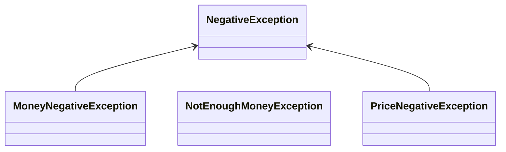

### :link: 2025-05-14
- [Exception](#1-exception) - [1](#1), [2](#2-예외-처리-방법), [3](#3-overriding)
- [Input - Output](#2-input---output) - [1](#1-file-class), [2](#2-stream), [3](#3-fileinputstream), [4](#4-filereader), [5](#5-fileoutputstream), [6](#6-filewriter)
 
&nbsp;
### 1. Exception
#### 1)
```
오류(Error): 시스템 상에서 프로그램에 심각한 문제가 발생하여 실행중인 프로그램이 종료되는 것.
예측 및 대응 불가.

예외(Exception): 프로그램이 종류되지만, 개발자가 미리 예측하고 처리할 수 있는 미약한 오류.
```
```
java.lang.Throwable
├── Error
│   ├── VirtualMachineError
│   └── AWTEError
│
└── Exception
    ├── IOException
    │   ├── FileNotFoundException
    │   └── EOFException
    └── RuntimeException
    │   ├── ArthmeticException
    │   ├── NullPointerException
    └── └──  IndexOutOfBoundsException
```
#### 2) 예외 처리 방법
&emsp; throws로 위임 - 메소드 구문으로 예외를 강제로 발생
```java
    public static void main(String[] args) throws Exception {
        ExceptionTest et = new ExceptionTest();
        et.checkEnoughMoney(10000, 50000);
```
```java
public class ExceptionTest {
    public void checkEnoughMoney(int price, int money) throws Exception {
```
╰&emsp; 실행하는 곳에서도 예외 발생시켜야 함

&emsp; 

&emsp; try-catch(또는 try-catch-finally) 처리
```java
        ExceptionTest et = new ExceptionTest();
        try {
            /*예외 발생 가능성이 있는 메소드는 try 블럭 안에서 호출*/
            et.checkEnoughMoney(10000, 5000);
            /*위의 메소드 호출 시 예외가 발생하지 않는 경우 try 블럭의 코드가 실행*/
            System.out.println("=============상품 구입 가능=============");

        } catch (Exception e) {
            /*위의 메소드 호출 시 예외가 발생하는 경우 catch 블럭의 코드가 실행*/
            System.out.println("=============상품 구입 불가능=============");
        }

        System.out.println("프로그램을 종료합니다.");
```
&emsp; try-catch 블록의 실행 흐름
```
try {1순위 실행}
catch {2순위 실행 - 이때 예외가 처리된 경우, 바로 빠져나가 finally 블록으로 넘어가거나 try-catch 구문을 빠져나간다.}
catch {3순위 실행 - 상단에서 exception이 catch되지 않은 경우}
finally {블록 중 마지막으로 실행}
try-catch 블록이 모두 처리된 이후 실행
```

```java
        ExceptionTest et = new ExceptionTest();

        try {
            et.checkEnoughMoney(-20000, 30000);
        } catch (PriceNegativeException e) {
            System.out.println("PriceNegativeException 발생!");
            System.out.println(e.getMessage()); //getMessage(); 메시지를 가져옴
        } catch (MoneyNegativeException e) {
            System.out.println("MoneyNegativeException 발생!");
            System.out.println(e.getMessage());
        } catch (NotEnoughMoneyException e) {
            System.out.println("NotEnoughException 발생!");
            System.out.println(e.getMessage()); //상위 관계를 아래쪽에 두어야 함(상속하는 부모, Exception)
        } finally {
            /*예외 발생 여부와 상관 없이 실행할 내용*/
            System.out.println("finally 블록이 동작함");
        }
```
```java
        ExceptionTest et = new ExceptionTest();

        try {
            et.checkEnoughMoney(20000, 10000);
        } catch (NotEnoughMoneyException e) {
            //예외 클래스명, 예외발생 위치, 예외 메시지 등을 stack 호출 역순으로
            //빨간색 글씨를 이용해서 로그 형태로 출력해주는 기능
            e.printStackTrace();

        } catch (PriceNegativeException | MoneyNegativeException e) {
            //발생한 예외 클래스의 이름
            System.out.println(e.getClass() + "발생!");
            System.out.println(e.getMessage());

        } finally {
            System.out.println("finally 블럭이 동작함");
        }
        System.out.println("프로그램을 종료합니다.");
```

|예외 출력 메소드|출력 내용|
|:--:|:--:|
|e.getMessage()|예외의 원인을 간단하게 출력|
|e.toString()|예외의 내용과 원인을 출력|
|e.printStackTrace()|예외 클래스명, 예외발생 위치, 예외 메시지 등을 stack 호출 역순으로 출력|
|e.getClass()|발생한 예외 클래스의 이름 출력|

#### 3) Overriding

```java
//SuperClass
    public void method() throws IOException {

    }
```
```java
public class SubClass extends SuperClass{

   @Override
   public void method() {} //예외 없이 오버라이딩 가능

    //같은 예외를 던져주는 구문으로 오버라이딩 해야 한다.
   @Override
   public void method() throws IOException {}

    //부모의 예외처리 클래스보다 상위의 예외는 후손클래스에서 오버라이딩 불가능
//    @Override
//    public void method() throws Exception{}

    //부모의 예외처리 클래스보다 더 하위에 있는 예외(즉, 더 구체적인 예외상황)인 경우 오버라이딩 가능
    @Override
    public void method() throws FileNotFoundException {}
}
```
```
//오버라이딩-오버로딩 차이
오버라이딩: 메서드 이름, 매개변수, 반환 타입 일치
오버로딩: 매개변수 개수, 매개변수 타입 다르게 정의
;메소드 시그니처(매개변수 이름, 매개변수 리스트의 조합)
```

&nbsp;
### 2. Input - Output
#### 1) File Class
```java
    public static void main(String[] args) {

        File file = new File("src/main/java/com/ogiraffers/section01/file/test.text");

        try {
            /*파일 생성 후 성공 실패 여부를 boolean으로 리턴한다.*/
            boolean creatsSuccess = file.createNewFile();
            System.out.println("creatsSuccess = " + creatsSuccess);
        } catch (IOException e) {
            e.printStackTrace();
        }

        System.out.println("파일의 크기 : " + file.length() + "byte");
        // 0byte

        System.out.println("파일의 경로 : " + file.getPath());
        // src/main/java/com/ogiraffers/section01/file/test.text

        System.out.println("현재 파일의 상위 경로 : " + file.getParent());
        // src/main/java/com/ogiraffers/section01/file

        System.out.println("파일의 절대 경로 : " + file.getAbsolutePath());
        // /Users/-/Documents/-/java/chap14-io-lecture-source/src/main/java/com/ogiraffers/section01/file/test.text

        //파일 삭제
        boolean deleteSuccess = file.delete();
        System.out.println("deleteSuccess = " + deleteSuccess);
    }
```

|File 클래스 메소드|작동 방식|
|:--:|:--:|
|.createNewFile()|boolean, 파일 생성 후 성공/실패 여부|
|.getPath()|파일의 경로|
|.getParent()|파일의 상위 경로|
|.delete()|파일 삭제 - 삭제 성공여부 boolean 값 반환 가능|

#### 2) Stream
```
# Stream

Java에서의 Stream은 **데이터의 흐름**을 의미한다. 파일, 네트워크, 메모리 등 다양한 매체로부터 데이터를 **입력하거나 출력**할 때 사용된다.

Java는 `java.io` 패키지에서 기본적인 스트림 클래스를 제공한다.

## 클래스별 입출력 단위 (암기)

- **InputStream / OutputStream**: 바이트 기반 입출력 (1바이트 단위)
- **Reader / Writer**: 문자 기반 입출력 (2바이트 이상, 보통 UTF-16 문자 처리용)
```
  
|기준|구분|클래스 예시|
|:--:|:--:|:--:|
|방향|입력 스트림|`InputStream`, `Reader`|
||입력 스트림|`OutputStream`, `Writer`|
|데이터 처리 단위|바이트 스트림|`InputStream`, `OutputStream`|
||문자 스트림|`Reader`, `Writer`|

#### 3) FileInputStream
```java
        FileInputStream fin = null;

        try {
            fin = new FileInputStream("src/main/java/com/ogiraffers/section02/stream/testInputStream.txt");

            int value;

            //read() : 파일에 기록된 값을 순차적으로 읽어오고 더이상 읽어올 데이터가 없는 경우 -1을 반환
            while ((value = fin.read()) != -1) {

//                System.out.print(value);

                System.out.print((char) value); //1바이트씩 읽어오는 방법

            }

            System.out.println();

            System.out.println("파일의 길이 : " + new File("src/main/java/com/ogiraffers/section02/stream/testInputStream.txt").length());

            /*1 byte씩 읽어와야 하는 경우도 존재하긴 하지만 대부분 경우 굉장히 비효율적이다.
             * byte 배열을 이용해서 한번에 데이터를 읽어오는 방법도 제공한다.
             * 파일의 길이만큼의 byte 배열을 만든다.*/

            int filesize = (int) new File("src/main/java/com/ogiraffers/section02/stream/testInputStream.txt").length();
            byte[] bar = new byte[filesize];

            fin.read(bar); //한번에 읽어오는 방법

        } catch (FileNotFoundException e) {
            e.printStackTrace();
        } catch (IOException e) {
            e.printStackTrace();
        } finally {
            //fin 인스턴스가 null이 아닌 경우 자원 반납을 해야 한다.
            if (fin != null) {
                try {
                    fin.close();

                    /*자원 반납을 해야 하는 경우
                     * 1. 장기간 실행중인 프로그램에서 스트림을 닫지 않는 경우 다양한 리소스에서 누수(leak)가 발생한다.
                     * 2. 뒤에서 배우는 버퍼를 이용하는 경우 마지막에 flush()로 버퍼에 있는 데이터를 강제로 전송해야 한다.
                     * 만약 잔류 데이터가 남은 상황에서 추가로 스트림을 사용한다면 데드락(deadlock) 상태가 된다.
                     * 판단하기 어렵고 의도하지 않은 상황에서도 이러한 현상이 발생할 수 있기 때문에 마지막에는 flush()를
                     * 무조건 실행해주는 것이 좋다.
                     * close() 메소드는 자원을 반납하며 flush()를 해주기 때문에 close()만 제대로 해줘도 ㅗ디낟.
                     * 따라서 close() 메소드는 이보 자원을 사용하는 경우 반드시 마지막에 호출해줘야 한다.
                     * */

                } catch (IOException e) {
                    throw new RuntimeException(e);
                }
                //(sc.close())
            }
        }
```

#### 4) FileReader
```
FileInputStream과 사용하는 방법은 거의 동일하다.
단, byte 단위가 아닌 character 단위로 읽어오는 부분이 차이점이다.
따라서 글자 단위로 읽어오기 때문에 한글을 정상적으로 읽어올 수 있다.
```
```java
        FileReader fr = null;

        try {
            fr = new FileReader("src/main/java/com/ogiraffers/section02/stream/testReader.txt");

            int value;
            while ((value = fr.read()) != -1) {
                System.out.print((char) value);
            }
        } catch (FileNotFoundException e) {
            throw new RuntimeException(e);
        } catch (IOException e) {
            e.printStackTrace();
        } finally {
            if (fr != null) {
                try {
                    fr.close();
                } catch (IOException e) {
                    throw new RuntimeException(e);
                }
            }
        }
```

#### 5) FileOutputStream
```
프로그램의 데이터를 파일로 내보내기 위한 용도의 Stream이다.
1바이트 단위로 데이터를 처리한다.
```
```java
        FileOutputStream fout = null;

        //OutputStream의 경우 대상 파일이 존재하지 않으면 파일을 자동으로 생성해준다.
        try {

            //OutputStream의 경우 대상 파일이 존재하지 않으면 파일을 자동으로 생성해준다.
            fout = new FileOutputStream("src/main/java/com/ogiraffers/section02/stream/testOutputStream");

            fout.write(97);

            // 10 : 개행문자 (엔터)
            byte[] bar = new byte[] {98, 99, 100, 101, 102, 10};
            fout.write(bar);

            fout.write(bar, 1, 3);

        } catch (FileNotFoundException e) {
//            e.printStackTrace();
            throw new RuntimeException(e);
        } catch (IOException e) {
            throw new RuntimeException(e);
        } finally {
            if(fout != null) {
                try {
                    fout.close();
                } catch (IOException e) {
                    throw new RuntimeException(e);
                }
            }
        }
```

#### 6) FileWriter
```
프로그램의 데이터를 파일로 내보내기 위한 용도의 스트림이다.
글자 단위로 데이터를 처리한다.
```
```java
        FileWriter fw = null;

        try {
            fw = new FileWriter("src/main/java/com/ogiraffers/section02/stream/testWriter");

            fw.write(97);
            fw.write('A');

            fw.write(new char[]{'a', 'p', 'p', 'l', 'e'});

            fw.write("블러..");

        } catch (FileNotFoundException e) {
            e.printStackTrace();
        } catch (IOException e) {
            throw new RuntimeException(e);
        } finally {
            if (fw != null) {
                try {
                    fw.close();
                } catch (IOException e) {
                    throw new RuntimeException(e);
                }
            }
        }
```
